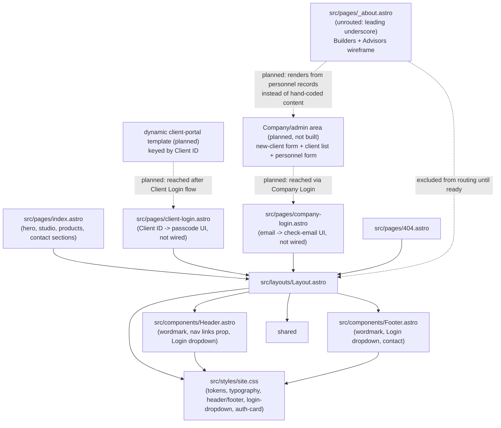
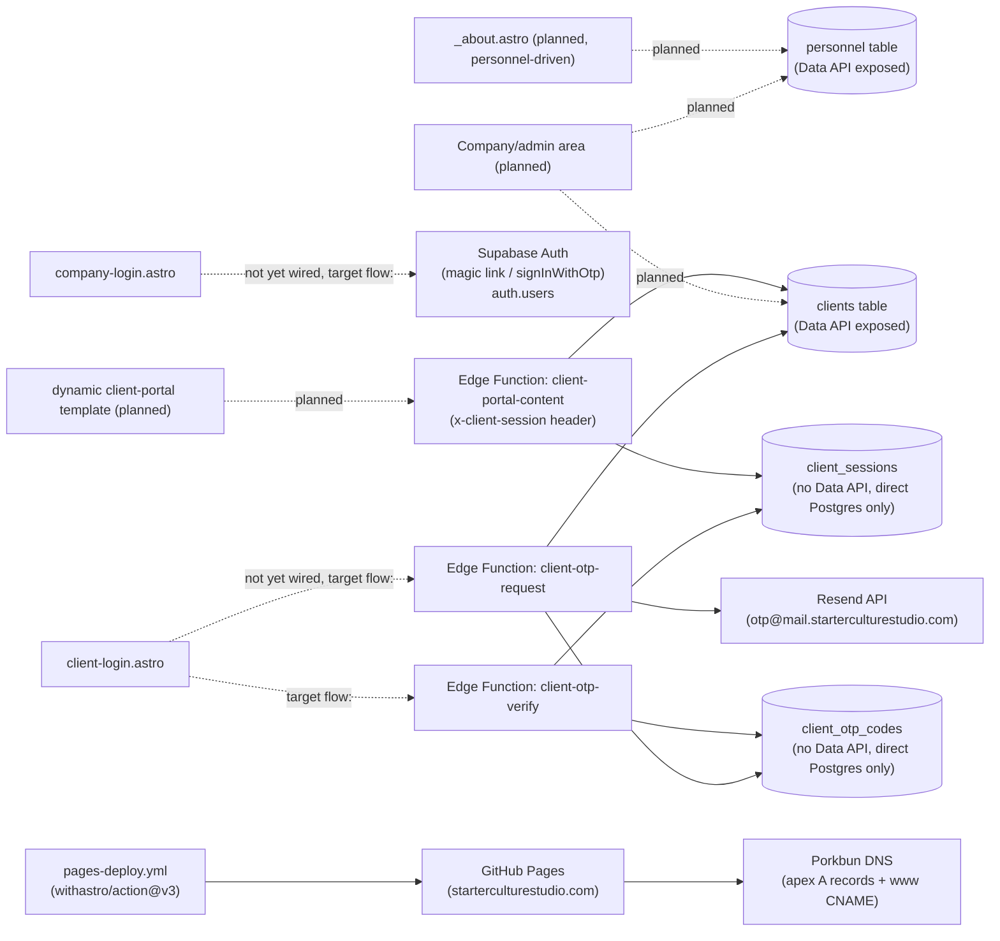
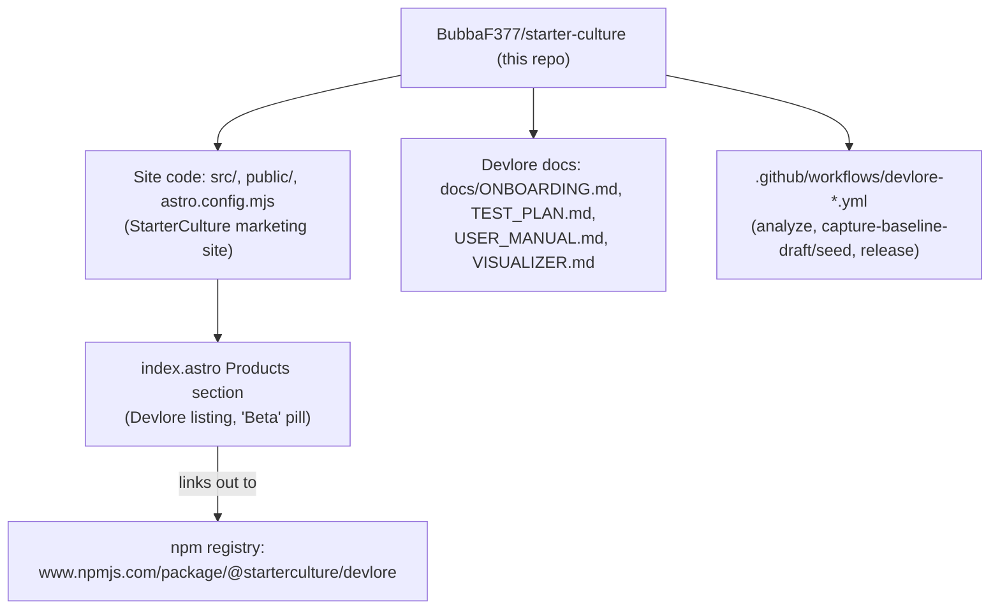

<!-- devlore:visualizer source-hash:8877ed1275cec36568397d4a7e01c4df2a4feb2ba96fd30650af10f42f0b7aa5 -->
> **Do not move, rename, or edit this file.** Devlore generates and maintains this diagram automatically from `docs/PRODUCT.md`'s requirements — manual edits will be overwritten the next time Devlore detects the requirements have changed. To change what's diagrammed, update `docs/PRODUCT.md` itself.

Two things worth noting before the diagrams: the "internal structure" diagram covers Astro-level files (pages/components/layouts/styles) plus the planned admin/about pieces described in the product doc; data-layer and third-party calls are separated into the external-dependencies diagram to keep each readable. A third diagram is included because the product doc does describe a real connection — this repo doubling as the site repo and the Devlore project repo, with an outbound link to Devlore's npm package.

