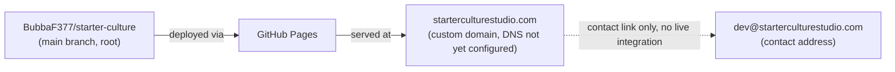
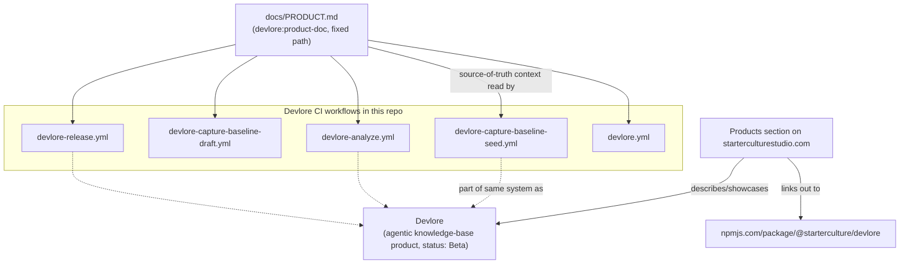

<!-- devlore:visualizer source-hash:f654157eb352e140bae4625c6f11242bd358407807d7c6b85b0d7be05ef2dbad -->
> **Do not move, rename, or edit this file.** Devlore generates and maintains this diagram automatically from `docs/PRODUCT.md`'s requirements — manual edits will be overwritten the next time Devlore detects the requirements have changed. To change what's diagrammed, update `docs/PRODUCT.md` itself.

Note on grounding: the codebase snapshot confirms there is **no application source code yet** — no `index.html`, `assets/`, or manifest files currently exist in the repo, only `docs/PRODUCT.md`, `README.md`, and the `.github/workflows/devlore-*.yml` files. The diagram below of the site's internal structure is therefore drawn from the *planned* structure described in `docs/PRODUCT.md` (requirements 1–3), not from code that has been built — I've labeled it accordingly.

Planned internal structure of the one-page site, as specified in `docs/PRODUCT.md` (not yet implemented in code):

```mermaid
graph TD
    subgraph "index.html (planned, not yet built)"
        Header["Header / nav<br/>(inlined logo mark)"]
        Hero["Hero section<br/>tagline + supporting line<br/>(inlined logo mark)"]
        Studio["Studio / about section"]
        Products["Products section<br/>(status pills)"]
        Contact["Contact section"]
        Footer["Footer<br/>(inlined logo mark + contact)"]
    end

    Header --> Hero --> Studio --> Products --> Contact --> Footer

    Wordmark["assets/starter-culture-logo.svg<br/>(wordmark)"]
    Avatar["assets/starter-culture-avatar.svg<br/>(icon-only mark)"]

    Wordmark -.->|inlined into| Header
    Wordmark -.->|inlined into| Hero
    Wordmark -.->|inlined into| Footer
    Avatar -.->|available as icon mark| Header

    Products -->|lists product: Devlore, "Beta" pill| DevloreEntry["Devlore product entry"]
```

External services the site depends on for hosting/delivery, per the deployment target in `docs/PRODUCT.md`:



Devlore is described as both a product showcased *on* the site and a separate tool that operates *on this same repo* via CI workflows and a published npm package — this is an actual documented connection, not speculative, so it's shown here rather than omitted:


