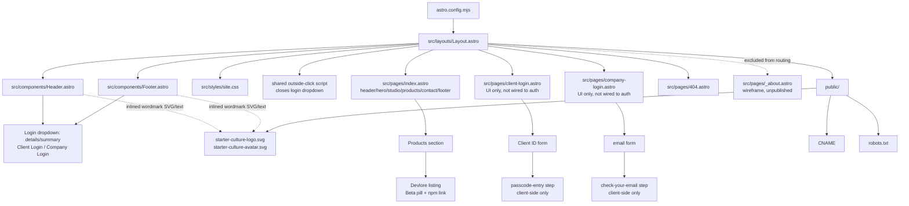
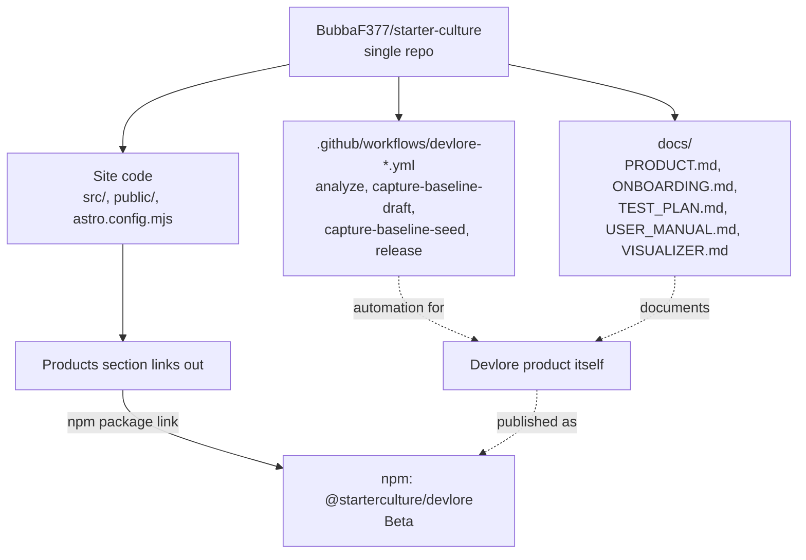

<!-- devlore:visualizer source-hash:9fe948fbdf8a97973e0586a48295b3bd7420a00f35cfb684b0afa49045e04868 -->
> **Do not move, rename, or edit this file.** Devlore generates and maintains this diagram automatically from `docs/PRODUCT.md`'s requirements — manual edits will be overwritten the next time Devlore detects the requirements have changed. To change what's diagrammed, update `docs/PRODUCT.md` itself.

**Internal structure** — this shows how the Astro site's own pages, shared components, styles, and static assets fit together, based on the file/page layout described in the product doc and baseline snapshot.



**External dependencies** — this shows the outside services the site relies on or is planned to rely on: GitHub Pages/Actions for hosting and deploys, Porkbun for DNS, the npm registry for the Devlore product link, and the not-yet-created Supabase project for auth/data once login and the admin area are built.

```mermaid
graph LR
    Repo[starter-culture repo] -->|release: published triggers| Workflow[.github/workflows/pages-deploy.yml<br/>withastro/action@v3]
    Workflow --> GHPages[GitHub Pages hosting]
    GHPages -->|custom domain via CNAME| Domain[starterculturestudio.com]
    Porkbun[Porkbun DNS<br/>apex A records + www CNAME] --> Domain
    GHPages -->|HTTPS cert issued| Domain

    IndexPage[index.astro Products section] -->|external link| NPM[npm registry<br/>@starterculture/devlore package]

    ClientLoginPage[client-login.astro] -.planned.-> Supabase[(Supabase project<br/>dedicated instance, not yet created)]
    CompanyLoginPage[company-login.astro] -.planned.-> Supabase
    Supabase -.planned.-> SupabaseAuth[Supabase Auth<br/>email OTP for clients,<br/>magic link for company]
    Supabase -.planned.-> SupabaseDB[(Supabase tables<br/>clients, personnel)]
    ClientLoginPage -.planned, ID lookup.-> EdgeFn[Supabase Edge Function<br/>candidate for Client ID → email lookup]
    EdgeFn -.planned.-> SupabaseDB
```

**Linked repos/projects** — the docs describe this single repo as doing double duty: it hosts the marketing site *and* Devlore-specific docs/automation, and separately the site links out to Devlore's published npm package. No other external repo connection is described, so no separate repo-to-repo diagram beyond this is included.


