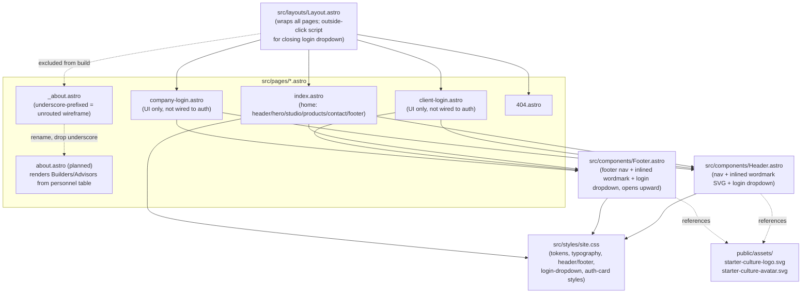
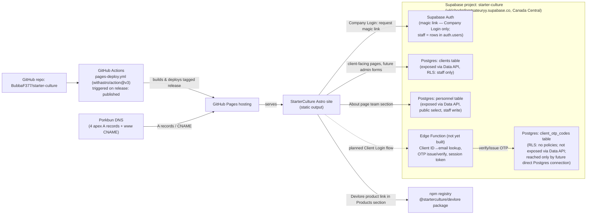
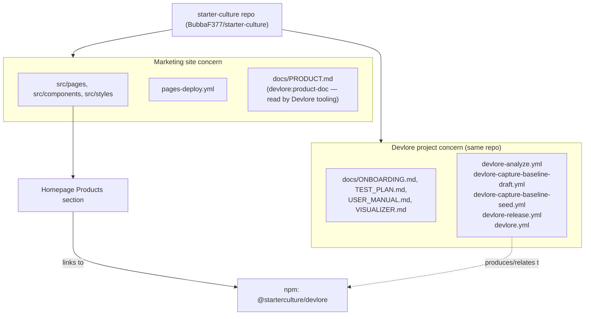

<!-- devlore:visualizer source-hash:93dc1f67fb5327d146601f6762be70fc148b59a6b0eb9650d4275e86529a3475 -->
> **Do not move, rename, or edit this file.** Devlore generates and maintains this diagram automatically from `docs/PRODUCT.md`'s requirements — manual edits will be overwritten the next time Devlore detects the requirements have changed. To change what's diagrammed, update `docs/PRODUCT.md` itself.

Since no live source files were provided beyond the file tree and prose descriptions, these diagrams are built from the product doc's explicit structural claims (components, tables, workflows) rather than from inspected code.

**Internal structure** — how the Astro pages, shared components/layout, and styling pieces fit together on the site itself.

**External dependencies** — the outside services the site (and its planned auth/admin flows) call or deploy through.

**Repo's dual purpose (Devlore connection)** — this repo isn't only the marketing site; per the baseline snapshot it also hosts Devlore's own project docs and automation, and the site links out to Devlore's published package.

