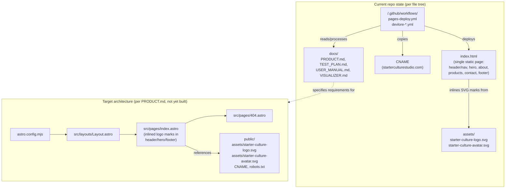
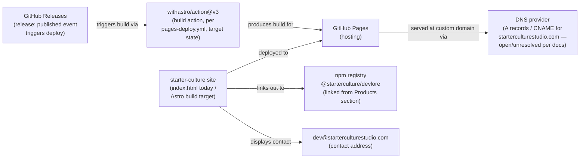
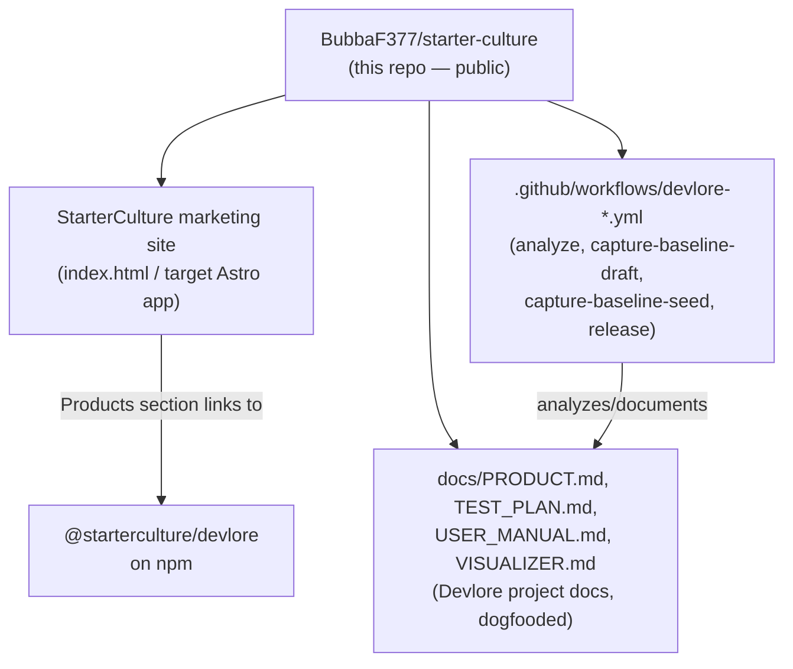

<!-- devlore:visualizer source-hash:3b84c138c180f6207604925ae1092a1364e4ee8b83ae856b8c02687249fbd2d5 -->
> **Do not move, rename, or edit this file.** Devlore generates and maintains this diagram automatically from `docs/PRODUCT.md`'s requirements — manual edits will be overwritten the next time Devlore detects the requirements have changed. To change what's diagrammed, update `docs/PRODUCT.md` itself.

A note first: the baseline snapshot describes the repo's **current** actual state as a plain static site (`index.html`, `assets/`, root `CNAME`), while `docs/PRODUCT.md` describes a **target** Astro-based rebuild (`astro.config.mjs`, `src/layouts`, `src/pages`, `public/`) that hasn't landed yet per the file tree. The diagrams below show both, clearly separated, rather than blending them into one false "as-built" picture.

This second diagram shows the outside services the project actually touches: GitHub Pages hosting/build tooling, DNS for the custom domain, the npm registry (where Devlore is linked from the Products section), and the studio's contact email — all explicitly named in the docs.

This third diagram reflects the docs' explicit statement that this single repo doubles as both the StarterCulture marketing site and the "Devlore-linked" project repo — i.e., it's wired into Devlore's own automation and it's the canonical place Devlore's product page/npm link points back to. No separate Devlore source repo is described in the material, so it isn't drawn as a distinct node beyond what's evidenced.

