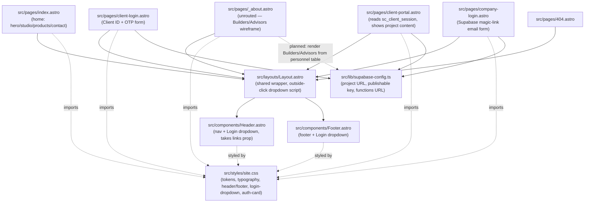
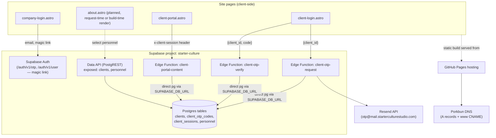
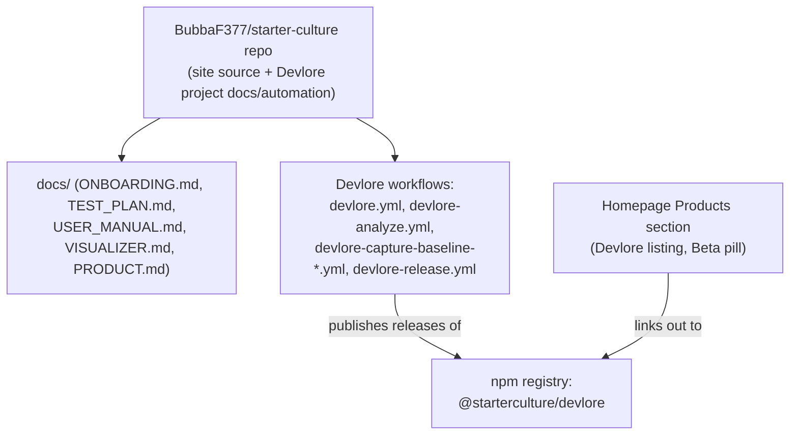

<!-- devlore:visualizer source-hash:1918d46f8716c86b81ce49d290186b9f607be0e9ec5e90321674667e50eecb63 -->
> **Do not move, rename, or edit this file.** Devlore generates and maintains this diagram automatically from `docs/PRODUCT.md`'s requirements — manual edits will be overwritten the next time Devlore detects the requirements have changed. To change what's diagrammed, update `docs/PRODUCT.md` itself.

Missing pieces: I don't have the actual contents of the Astro pages/components beyond what's described in PRODUCT.md and the baseline snapshot, so the internal diagram below is built from the documented file list and stated relationships only (e.g. "Header takes a `links` prop," "site.css imported by each page," which functions call which tables).

Shows how the site's shared layout/components/styles tie together the routed and not-yet-routed pages, and how the client-facing auth pages relate to the Supabase config module and Edge Functions.

Shows the browser-side pages calling out to Supabase's Auth/Edge Function/Data API surfaces, the Edge Functions' direct Postgres access, email delivery via Resend, and the static-hosting/DNS chain.

Shows the one documented external connection beyond hosted services: this repo also functions as the project home for the separately-shipped **Devlore** product, via its own workflows and its published npm package. (`heartland-fermenters-guild` is mentioned only as a same-stack sibling project for reference, not as an actual runtime or data connection, so it's omitted here.)

