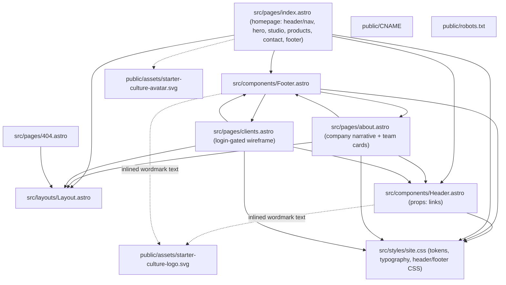
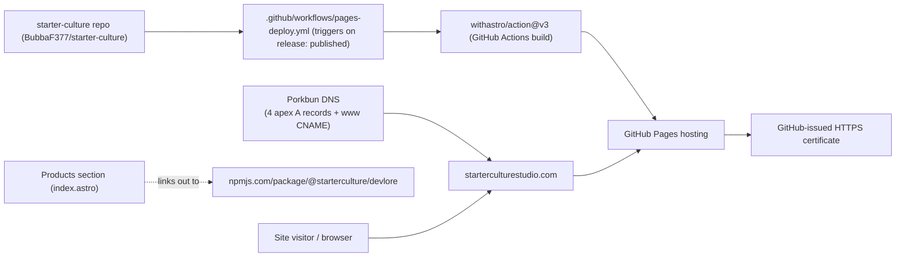
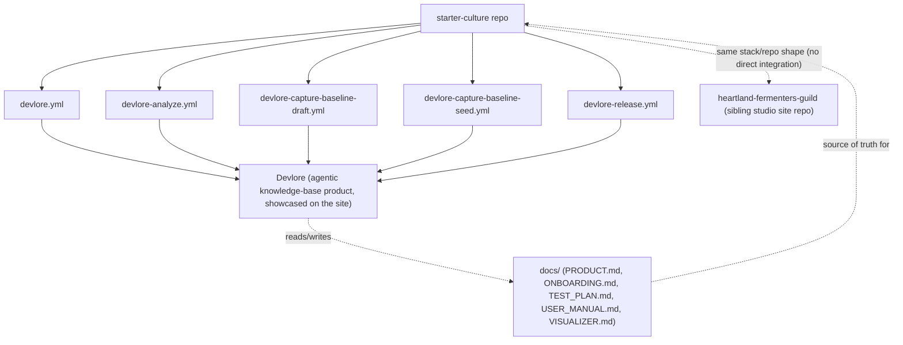

<!-- devlore:visualizer source-hash:f048fb8589402c3161543c4735788488f328ed83eb0752606959c8b43062b58c -->
> **Do not move, rename, or edit this file.** Devlore generates and maintains this diagram automatically from `docs/PRODUCT.md`'s requirements — manual edits will be overwritten the next time Devlore detects the requirements have changed. To change what's diagrammed, update `docs/PRODUCT.md` itself.

Since the codebase snapshot is present (structure inferred from file tree, filenames, and PRODUCT.md), the diagrams below are grounded in that plus the product doc.

**1. Internal structure** — how the Astro site's own pages, layout, shared components, and static assets fit together.

**2. External dependencies** — the outside services/APIs the built and deployed site actually relies on.

**3. Linked repos/projects** — the product doc explicitly describes this same repo also being used by Devlore's own automation (dogfooding), and names a sibling studio site sharing the same stack, so both are included as real, documented connections.

