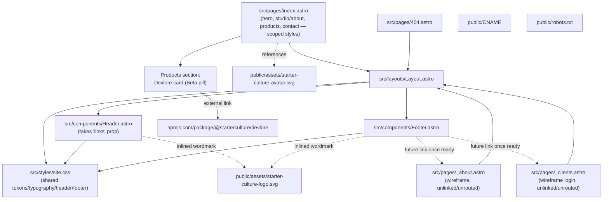
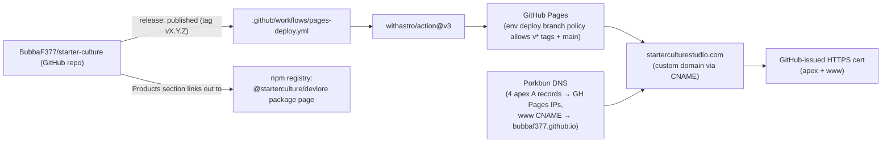
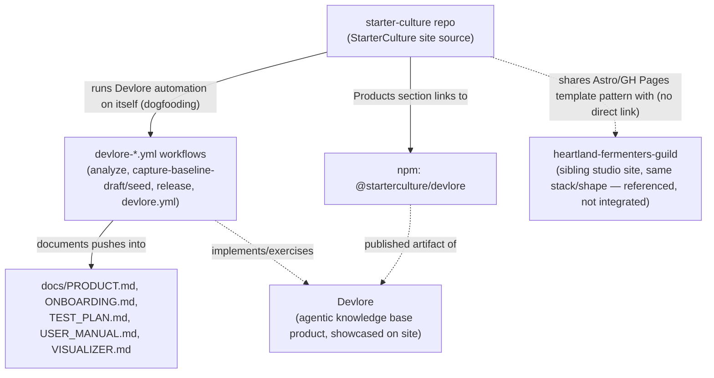

<!-- devlore:visualizer source-hash:ab7a06df95c9654d1e275570d9935b9744218b8e2537abbe2367276e546c9917 -->
> **Do not move, rename, or edit this file.** Devlore generates and maintains this diagram automatically from `docs/PRODUCT.md`'s requirements — manual edits will be overwritten the next time Devlore detects the requirements have changed. To change what's diagrammed, update `docs/PRODUCT.md` itself.

Since the baseline snapshot describes file names and the product doc describes required structure, but neither shows actual code contents beyond what's summarized, these diagrams are grounded in that inferred/declared structure only.

**1. Internal structure** — how pages, shared layout/components, and styles fit together per the site's Astro conventions.

**2. External dependencies** — the outside services the built/deployed site relies on (hosting, DNS, CI action, and the linked npm package).

**3. Other linked repos/projects** — the product doc explicitly describes this repo doing double duty as Devlore's own dogfooding target and linking to Devlore's published package; it also names a sibling studio site sharing the same template, which is noted here as a documented reference point rather than a runtime dependency.

