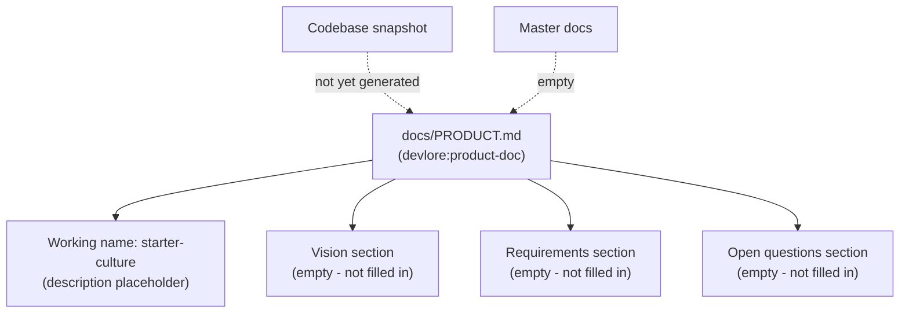

<!-- devlore:visualizer source-hash:e1b5a85745c03487306da36e42e77b5af24668f1f4d6ed481835c67db6b09d06 -->
> **Do not move, rename, or edit this file.** Devlore generates and maintains this diagram automatically from `docs/PRODUCT.md`'s requirements — manual edits will be overwritten the next time Devlore detects the requirements have changed. To change what's diagrammed, update `docs/PRODUCT.md` itself.

No codebase snapshot exists yet for this project, and the product doc itself is still an unfilled template — the description, vision, requirements, and open questions sections are all placeholder text with no actual content filled in. The master docs are empty as well. This means there is no evidenced information about internal modules, external APIs/services, or linked repos to draw from.

Because inventing any structure would violate the grounding constraint, I can't responsibly produce internal-structure, external-dependency, or linked-repo diagrams for this project at this time. The only thing that can be diagrammed truthfully is the current state of the documentation itself:

Once the one-time codebase analysis has run and/or the product doc's Vision, Requirements, and Open Questions sections are filled in, I'll be able to produce meaningful internal-structure and external-dependency diagrams grounded in that material.
