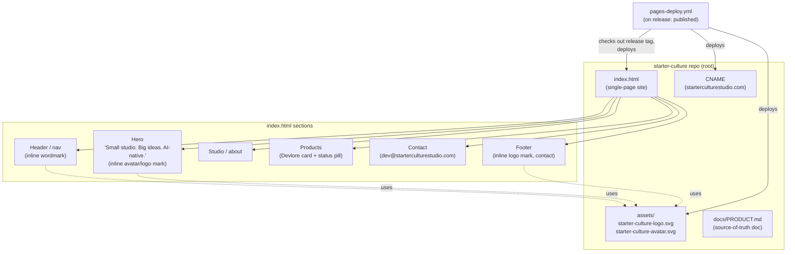
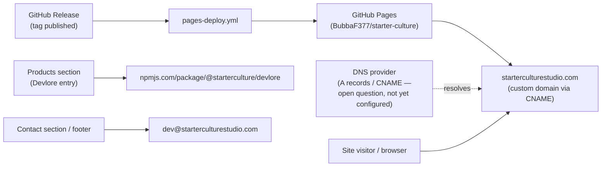
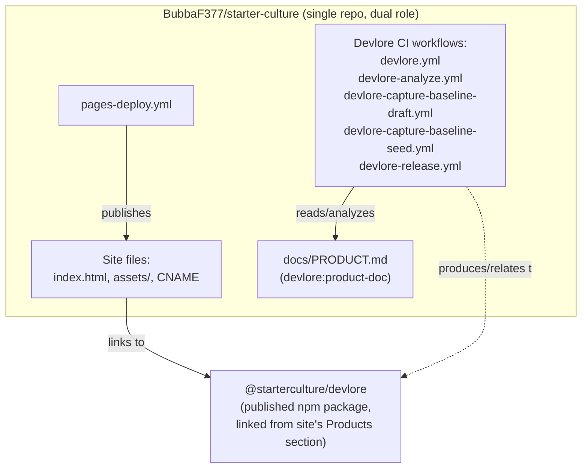

<!-- devlore:visualizer source-hash:07e5c9192a4f0a385ad74ba525ef3484b01f0a0da8c0cd17bfeaa8bd7977abf5 -->
> **Do not move, rename, or edit this file.** Devlore generates and maintains this diagram automatically from `docs/PRODUCT.md`'s requirements — manual edits will be overwritten the next time Devlore detects the requirements have changed. To change what's diagrammed, update `docs/PRODUCT.md` itself.

No application source code exists yet in the codebase snapshot — only `docs/PRODUCT.md`, a placeholder `README.md`, and a set of `devlore-*.yml` GitHub Actions workflow files (contents unseen). The diagrams below are therefore best-effort reconstructions from the product doc's description of the intended site structure and deployment pipeline, plus the workflow filenames visible in the tree.

Shows the planned internal structure of the one-page site: the sections inside `index.html`, the logo assets it inlines/references, and the release-triggered workflow that assembles them into the published site.

Shows the outside services and destinations the project touches: GitHub Pages/Releases for publishing the site, DNS for the custom domain, and the npm registry link surfaced in the Products section.

Shows the real connection described in the docs: this single repository doubles as both the StarterCulture marketing site and the project repo that Devlore's automation targets, with a separate published npm package for Devlore itself.

